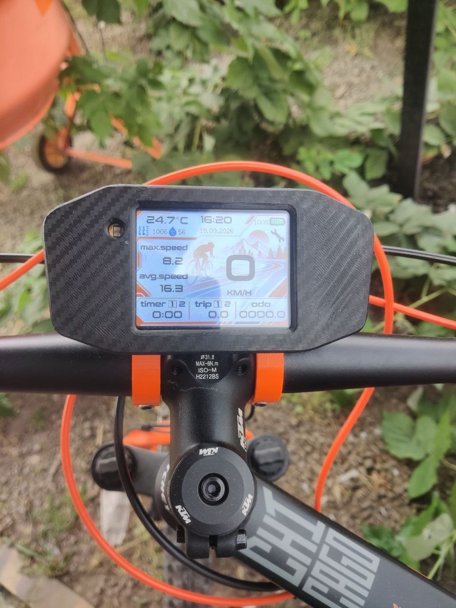
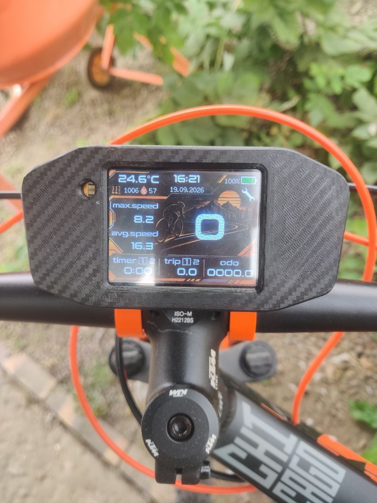
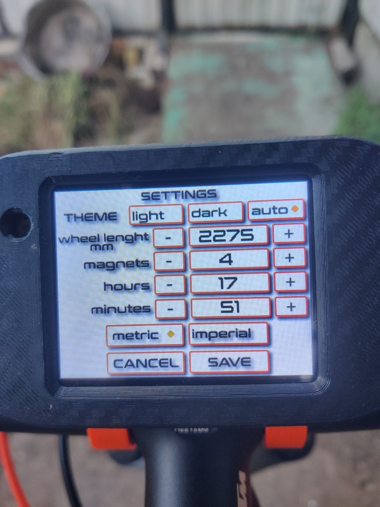

# ESP32-CYD-Bike-Computer
Open-source ESP32-based bicycle computer with a graphical display, speed tracking, trip statistics, environmental sensors, and customizable UI





## Features

- Real-time speed measurement
- Average and maximum speed
- Trip distance and total odometer
- Temperature, atmospheric pressure and humidity monitoring
- Trip timer

- Important Notice

This bike computer is a DIY hobby project intended for recreational use only.

It is not a professional-grade device.
Do not use it in competitions or situations where accurate measurements are critical.
It is not waterproof. Using it in rainy conditions is not recommended.

- # About the Project (для описания на русском листайте ниже)

The entire codebase was written by AI. It went through many iterations before I achieved the desired result, so the code may not be fully optimized.
This bike computer is installed on my personal KTM bicycle. That's also where the enclosure design comes from — it is inspired by the instrument cluster of the KTM Duke 790–890 motorcycles.
The mounting system should also fit bicycles from other brands with the following dimensions:

* Fork tube diameter: 35 mm
* Handlebar diameter at the mounting point: 32 mm
For other dimensions, you may need to make minor modifications to the 3D models of the mounting brackets.

---

## Assembly
Assembly is straightforward, but it requires basic soldering skills and some understanding of electrical circuits.

**The most important rule: always connect positive (+) to positive (+) and negative (−) to negative (−).**

If you don't understand the difference between positive and negative polarity, ask someone with electrical experience for help.

An assembly diagram is available in the `assembly photos` folder.

**Disclaimer:** I am not responsible for any damage caused by incorrect wiring or reversed polarity, including damage to microchips or other electronic components.

---

## Basic Operation

Using the bike computer is simple — turn it on and ride!

To turn it off, press and hold the button for 10 seconds.

### Timer

* Tap the **Timer** area to switch between active timers.
* Long-press the Timer area to reset the currently selected timer.

### Trip

* Tap the **Trip** area to switch between Trip 1 and Trip 2.
* Long-press the Trip area to reset the selected trip. This also resets the maximum and average speed recorded for that trip.

The total odometer runs continuously and saves its value to non-volatile memory every 100 meters.

### Battery Indicator

Tap the battery level indicator to switch between percentage (%) and voltage (V).

---

## Settings

Tap the wrench icon to open the Settings page.

### 1. Display Theme

Choose between three display modes:

* Light theme
* Dark theme
* Automatic switching based on the ambient light sensor

### 2. Wheel Circumference

The default wheel circumference is **2275 mm**, with an adjustment step of **5 mm**.

Alternatively, you can set the exact value directly in the source code.

Find the following line:

```cpp
float wheelCircumferenceMm = 2275;
```

Replace `2275` with your measured wheel circumference in millimeters.

### 3. Number of Wheel Magnets

Set the number of magnets installed on the wheel.

Using more magnets provides smoother speed measurements.

**Important:** If you use more than one magnet, they must be evenly spaced around the wheel, with an equal number of spokes between them.

### 4. Set Hours

Adjust the current hour.

### 5. Set Minutes

Adjust the current minute.

**Important:** The date is set automatically when the firmware is compiled. Therefore, the firmware must be compiled and uploaded on the same day to ensure the correct date.

### 6. Measurement Units

Choose between two measurement systems:

| Metric | Imperial |
| ------ | -------- |
| km     | mi       |
| km/h   | mph      |
| °C     | °F       |
| mmHg   | inHg     |

---

## How to Accurately Measure Wheel Circumference

Accurate wheel circumference measurement is important for correct speed and distance calculations.

Follow these steps:

1. Place your bicycle on a flat surface and position the wheel so that the tire valve is at the bottom, closest to the ground.
2. Make a mark on the ground directly below the valve.
3. Roll the bicycle forward until the wheel completes exactly one full revolution and the valve returns to the bottom.
4. Make a second mark on the ground.
5. Use a measuring tape to measure the distance between the two marks.

The measured distance is your wheel circumference in millimeters.

Enter this value in the bike computer settings or directly in the source code.

Troubleshooting
Speed Always Shows 0

If the speed reading remains at 0 km/h while riding, check the following:

Magnet is too far from the Hall sensor. The distance between the magnet and the sensor may be too large for reliable detection.
Magnet is not properly aligned. The magnet may be passing above or below the Hall sensor instead of directly in front of it.

Incorrect magnet polarity or Hall sensor orientation. The magnet may be facing the sensor with the wrong magnetic pole, or the Hall sensor may be installed facing the wrong direction.

Refer to the photos in the assembly photos folder for the correct Hall sensor orientation.

Securing Components

The magnetic USB connector, BME280 sensor, and 3-pin connector can be secured in place using a couple of drops of superglue.

It is recommended to secure the battery using hot glue. Additionally, place a thin layer of soft, electrically insulating material between the battery and the rear cover to provide cushioning and prevent direct contact.

# 🚴 Велокомпьютер на ESP32

Самодельный велокомпьютер на базе ESP32 с сенсорным управлением, измерением скорости и расстояния, двумя независимыми поездками, таймерами и возможностью настройки интерфейса.

Проект создан для личного использования и любительских экспериментов.

---

## ⚠️ Важная информация

> **Внимание!**
>
> * Устройство не является профессиональным измерительным прибором.
> * Не используйте его в соревнованиях.
> * Проект создан исключительно для любительского использования и развлечения.
> * Устройство не является водонепроницаемым. Использование во время дождя не рекомендуется.

---

## 📖 О проекте

Весь программный код написан с помощью ИИ (большая часть ChatGPT, также использован Claude и Github Copilot).

Проект прошёл множество итераций и доработок, прежде чем мне удалось получить желаемый результат. Поэтому код может быть не самым оптимальным, но он реализует необходимую мне функциональность.

Велокомпьютер установлен на моём личном велосипеде **KTM**. Именно поэтому корпус устройства стилизован под приборную панель мотоциклов KTM Duke 790–890.

### 🔧 Совместимость крепления

Крепление разработано под следующие размеры:

| Параметр                       | Размер |
| ------------------------------ | ------ |
| Диаметр пера вилки             | 35 мм  |
| Диаметр руля в месте крепления | 32 мм  |

Устройство может подойти и для велосипедов других производителей с аналогичными размерами.

Если размеры вашего велосипеда отличаются, возможно, потребуется немного доработать 3D-модели крепёжных элементов.

---

## 🛠️ Сборка

Сборка достаточно простая, однако потребуются базовые навыки пайки и понимание основ электротехники.

### ⚡ Важно соблюдать полярность!

**Главное правило:**

* Плюс (+) соединяется с плюсом (+).
* Минус (−) соединяется с минусом (−).

Если вы не понимаете разницу между плюсом и минусом, обратитесь за помощью к человеку, имеющему опыт работы с электроникой.

📁 Схема сборки и фотографии правильного расположения компонентов находятся в папке `assembly photos`.

> ⚠️ **Отказ от ответственности**
>
> Автор не несёт ответственности за повреждение микросхем, датчиков и других электронных компонентов вследствие неправильного подключения, перепутанной полярности или ошибок при сборке.

---

## 🎮 Управление велокомпьютером

Управление максимально простое: включили устройство — и можно ехать!

### 🔘 Включение и выключение

| Действие                   | Результат                                  |
| -------------------------- | ------------------------------------------ |
| Включение устройства       | Включите велокомпьютер и начинайте поездку |
| Удержание кнопки 10 секунд | Выключение устройства                      |

### ⏱️ Таймер — TIMER

Управление осуществляется касанием области `TIMER` на экране.

| Действие         | Результат                      |
| ---------------- | ------------------------------ |
| Короткое касание | Переключение активного таймера |
| Долгое касание   | Обнуление выбранного таймера   |

### 🚴 Поездки — TRIP

Велокомпьютер поддерживает два независимых счётчика поездок: `TRIP 1` и `TRIP 2`.

| Действие         | Результат                          |
| ---------------- | ---------------------------------- |
| Короткое касание | Переключение между поездками 1 и 2 |
| Долгое касание   | Сброс выбранной поездки            |

При сбросе поездки также обнуляются:

* Максимальная скорость данной поездки.
* Средняя скорость данной поездки.

### 🛣️ Общий пробег — ODO

Общий одометр работает постоянно, независимо от выбранной поездки.

**Каждые 100 метров** значение общего пробега сохраняется в энергонезависимую память.

Это позволяет сохранять накопленный пробег после выключения устройства.

### 🔋 Индикатор батареи

Касание области индикатора заряда батареи переключает формат отображения:

* `%` — уровень заряда в процентах.
* `V` — напряжение аккумулятора в вольтах.

---

## ⚙️ Настройки

Чтобы открыть страницу настроек, коснитесь значка гаечного ключа 🔧 на экране.

В меню доступны следующие параметры.

### 1. 🎨 Тема оформления

Доступны три режима:

| Режим          | Описание                                             |
| -------------- | ---------------------------------------------------- |
| Светлая тема   | Светлое оформление интерфейса                        |
| Тёмная тема    | Тёмное оформление интерфейса                         |
| Автоматический | Переключение темы по показаниям датчика освещённости |

### 2. 📏 Длина окружности колеса

Этот параметр необходим для правильного расчёта скорости и пройденного расстояния.

| Параметр              | Значение |
| --------------------- | -------- |
| Значение по умолчанию | 2275 мм  |
| Шаг изменения         | 5 мм     |

Длину окружности можно изменить непосредственно в настройках велокомпьютера.

Также можно заранее указать необходимое значение в исходном коде.

Найдите строку:

```cpp
float wheelCircumferenceMm = 2275;
```

Замените `2275` на измеренную длину окружности вашего колеса в миллиметрах.

Подробная инструкция по измерению приведена ниже.

### 3. 🧲 Количество магнитов

Укажите количество магнитов, установленных на колесе.

Чем больше магнитов используется, тем плавнее происходит измерение скорости.

> ⚠️ **Важное правило**
>
> Если установлено более одного магнита, они должны располагаться равномерно по окружности колеса — через одинаковое количество спиц.

### 4. 🕒 Установка часов

Позволяет установить текущее значение часов.

### 5. 🕒 Установка минут

Позволяет установить текущее значение минут.

**Особенность установки даты:**

Дата устанавливается автоматически в момент компиляции прошивки.

Поэтому компиляция и загрузка прошивки в ESP32 должны выполняться в один и тот же день, чтобы дата была правильной.

### 6. 🌍 Система единиц измерения

Велокомпьютер поддерживает две системы единиц измерения.

| Параметр    | Метрическая | Имперская |
| ----------- | :---------: | :-------: |
| Расстояние  |      km     |     mi    |
| Скорость    |     km/h    |    mph    |
| Температура |      °C     |     °F    |
| Давление    |     mmHg    |    inHg   |

---

## 📐 Как правильно измерить длину окружности колеса

Для точного измерения скорости и расстояния необходимо правильно указать длину окружности колеса.

Самый простой способ — измерить расстояние, которое велосипед проходит за один полный оборот колеса.

### Пошаговая инструкция

**Шаг 1. Подготовка**

Поставьте велосипед на ровную поверхность.

Поверните колесо так, чтобы ниппель находился в самой нижней точке, рядом с землёй.

**Шаг 2. Первая отметка**

Сделайте отметку на земле непосредственно под ниппелем.

**Шаг 3. Один оборот**

Прокатите велосипед вперёд ровно на один полный оборот колеса.

Остановитесь, когда ниппель снова окажется в нижней точке.

**Шаг 4. Вторая отметка**

Сделайте вторую отметку на земле.

**Шаг 5. Измерение**

С помощью обычной рулетки измерьте расстояние между двумя отметками.

Полученное значение в миллиметрах и есть длина окружности вашего колеса.

> 💡 **Совет**
>
> Для более точного результата измеряйте колесо при обычном давлении в шине и с привычной нагрузкой на велосипед.

Введите полученное значение в настройках велокомпьютера или непосредственно в исходном коде.

Магнитный разъем, датчик BME280 и разъем 3-пин - крепятся с помощью пару капель суперклея
Аккумулятор лучше зафиксировать с помощью термоклея, а также между аккумулятором и задней крышкой желательно положить небольшой толщины мягкий изоляционный материал 

---

## 🔍 Возможные проблемы и их решение

### ❌ Скорость постоянно показывает 0

Если во время движения скорость остаётся равной нулю, проверьте следующие моменты.

**1. Слишком большое расстояние между магнитом и датчиком Холла**

Магнит может проходить слишком далеко от датчика, из-за чего тот не регистрирует его прохождение.

Решение: уменьшите расстояние между магнитом и датчиком.

**2. Неправильное положение магнита**

Магнит может проходить выше или ниже чувствительной области датчика Холла.

Решение: отрегулируйте положение магнита так, чтобы он проходил непосредственно напротив датчика.

**3. Неправильная полярность магнита или ориентация датчика Холла**

Возможные причины:

* Магнит обращён к датчику неподходящим магнитным полюсом.
* Датчик Холла установлен неправильной стороной к магниту.

Решение: проверьте ориентацию магнита и датчика Холла.

📁 Фотография правильного расположения датчика Холла находится в папке `assembly photos`.

---

## ❤️ Заключение

Это любительский DIY-проект, созданный для собственного велосипеда и удовольствия от процесса разработки.

Код может быть неидеальным, а конструкция — требовать адаптации под конкретный велосипед.

Надеюсь, проект окажется полезным тем, кто захочет собрать собственный велокомпьютер или использовать отдельные идеи в своих разработках.

**Приятной сборки и хороших поездок! 🚴**

